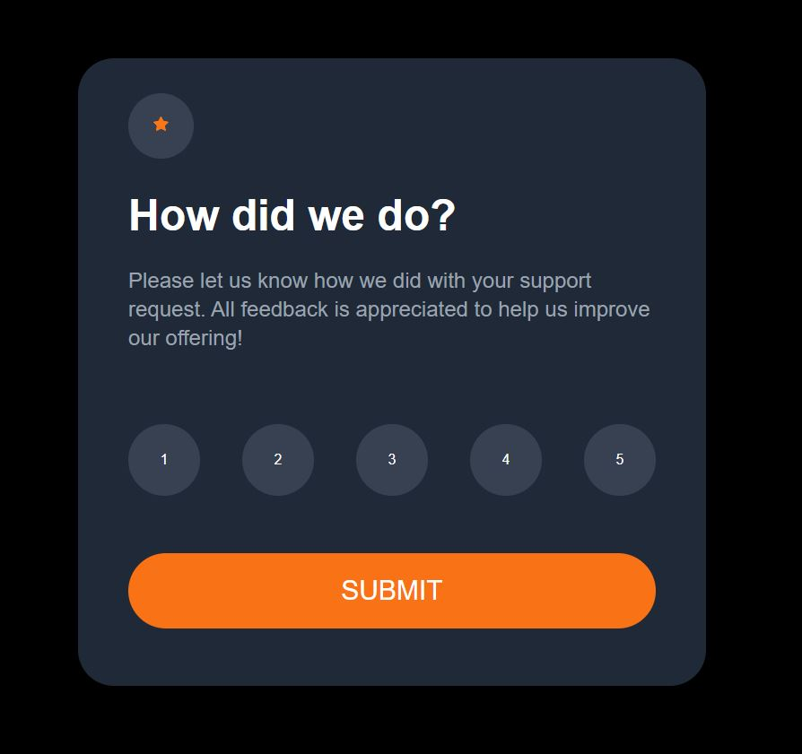
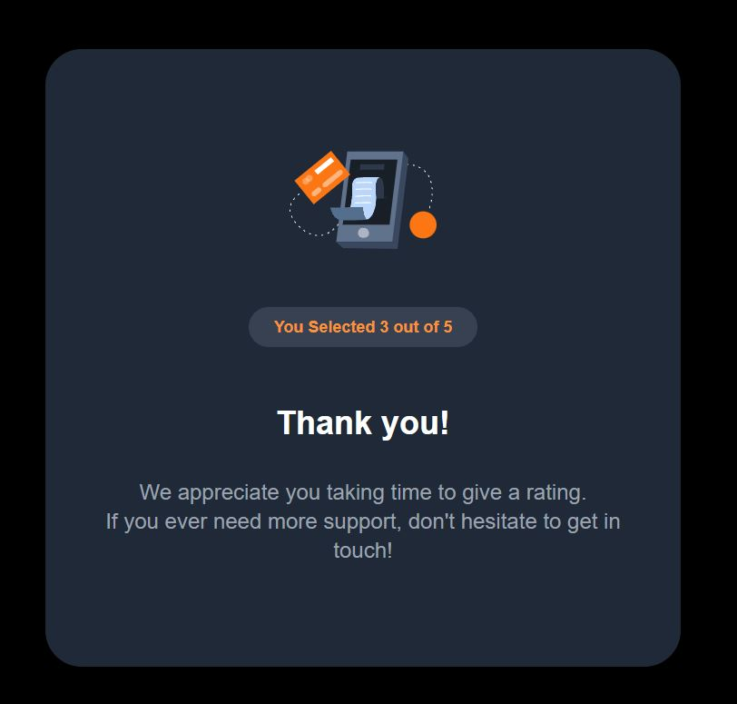

# Frontend Mentor - Interactive rating component solution

This is a solution to the [Interactive rating component challenge on Frontend Mentor](https://www.frontendmentor.io/challenges/interactive-rating-component-koxpeBUmI)

## Table of contents

- [Overview](#overview)
  - [The challenge](#the-challenge)
  - [Screenshot](#screenshot)
  - [Links](#links)
- [My process](#my-process)
  - [Built with](#built-with)
  - [What I learned](#what-i-learned)
- [Author](#author)

## Overview

### The challenge

Users should be able to:

- View the optimal layout for the app depending on their device's screen size
- See hover states for all interactive elements on the page
- Select and submit a number rating
- See the "Thank you" card state after submitting a rating

### Screenshot

### Links

- Solution URL: [Solution Github Repo (this)](https://github.com/sudwiptokm/frontend-mentor-Interactive-rating-component)
- Live Site URL: [Live Site/Demo](https://interactive-rating-componetn-fem.netlify.app/)

## My process

### Built with

- Semantic HTML5 markup
- Mobile-first workflow
- [Next.js](https://nextjs.org/) - React framework
- [Tailwind CSS](https://tailwindcss.com) - For CSS styles

### What I learned or Revised

I just revised state management and some basic designs. Nothing much complicated here

## Author

- Website - [Sudwipto Kumar Mondal](https://sudwipto-portfolio.netlify.app/)
- Frontend Mentor - [@sudwiptokm](https://www.frontendmentor.io/profile/sudwiptokm)
- Twitter - [@Poseidon_R6](https://www.twitter.com/Poseidon_R6)
